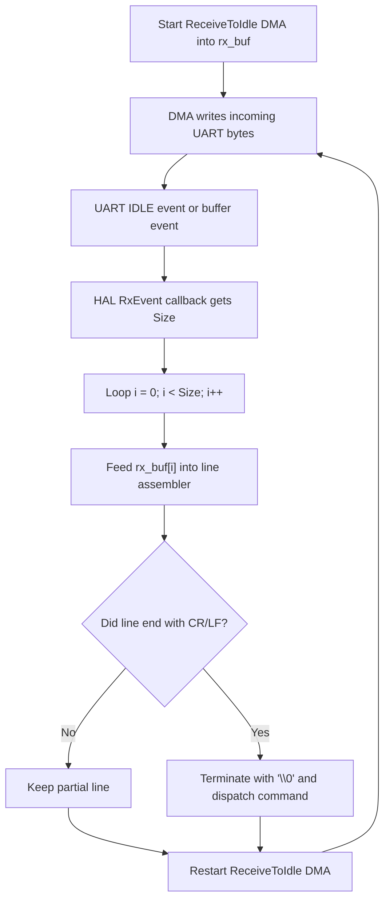

# uart_dma_idle

UART DMA + IDLE 接收和断帧处理。

## 本阶段边界

当前 P1 目标是理解和记录 UART DMA + IDLE 的接收流程，不进入真实功率控制。本文只作为 NUCLEO baseline 和后续 ESP32 网关协议的学习/设计锚点；它不是已经完成的 MCSDK 或电机运行验证。

禁止范围：

- 不接 24V。
- 不接功率板。
- 不接电机。
- 不输出三相 PWM Gate。
- 不运行 Motor Profiler。
- 不做 Hall/SMO 闭环。

## 白话模型

把 UART 接收想成“快递暂存箱”：

- DMA 是搬运工：它把串口收到的字节自动放进 `rx_buf`。
- IDLE 是门铃：串口安静一小段时间，说明这一批字节暂时收完了。
- `Size` 是这一批收到的字节数量，不是最后一个下标。
- CPU 收到通知后，只处理 `rx_buf[0]` 到 `rx_buf[Size - 1]`。
- 处理完必须重新打开接收，否则下一批字节没人收。

## P1 交付物：DMA + IDLE 接收流程



## `Size` 规则

| `Size` | 要处理的下标 | 最后一个下标 | 正确循环 |
| --- | --- | --- | --- |
| `1` | `0` | `0` | `for (i = 0; i < Size; i++)` |
| `3` | `0, 1, 2` | `2` | `for (i = 0; i < Size; i++)` |
| `10` | `0..9` | `9` | `for (i = 0; i < Size; i++)` |

禁止写成 `i <= Size`，因为那会多处理一个未收到的字节。

## 与当前代码的连接

当前 polling 版本已经把“逐字节喂给行组装器”的逻辑抽到了 `AppFeedRxByte(...)`：

```c
while (HAL_UART_Receive(&hcom_uart[COM1], &rx_ch, 1U, 0U) == HAL_OK)
{
  AppFeedRxByte(rx_ch, app_mode, mode_change_count, target_rpm);
}
```

DMA + IDLE 版本的核心迁移点是：入口从“一次 poll 一个字节”变成“一次 callback 给一批字节”，但每个字节仍然进入同一个行组装器。

概念结构如下：

```c
void HAL_UARTEx_RxEventCallback(UART_HandleTypeDef *huart, uint16_t Size)
{
  if (huart == &hcom_uart[COM1])
  {
    for (uint16_t i = 0U; i < Size; i++)
    {
      AppFeedRxByte(rx_buf[i], &app_mode, &mode_change_count, &target_rpm);
    }

    HAL_UARTEx_ReceiveToIdle_DMA(&hcom_uart[COM1], rx_buf, sizeof(rx_buf));
  }
}
```

实现前需要再做一次工程审查：如果该 callback 运行在中断上下文，就不能让它执行长耗时逻辑、JSON 解析、阻塞输出或 FOC 实时工作。最终工程更稳的写法通常是 callback 只搬运到环形缓冲或设置标志，主循环再调用命令处理。

## P1 验收问题

1. `Size = 10` 时，为什么最后一个有效下标是 `9`？
2. 为什么循环条件是 `i < Size`，不是 `i <= Size`？
3. 为什么处理完一批数据后必须重新启动 `ReceiveToIdle DMA`？
4. 为什么 ESP32 可以解析 JSON，但 STM32 的 JEOC/FOC ISR 不能解析 JSON？

通过这四个问题之前，不进入 ESP32 网关真实联调，也不进入 MCSDK 电机控制。
